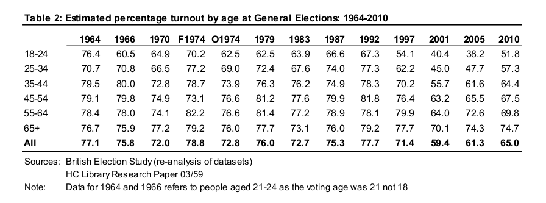

Russell Brand famously declared that he doesn't vote and urged others to do the same. However a few days before the election, faced with the prospect of a Conservative majority he changed his mind and urged voters to choose Labour.  Would it have made a difference if the sort of voters that may be influenced by Russell Brand had in fact voted labour?

## Historical trends in voter turnout.

The first aspect to look at is turnout.

Some data on historical turnout in the UK can be obtained from here. 

http://www.idea.int/vt/countryview.cfm?CountryCode=GB


```{r,echo=FALSE}
library(ggplot2)
library(reshape)
turnout<-read.csv("data/turnout.csv",head=T)
turnout$Turnout<-100*turnout$Votes/turnout$Registered
turnout$Percent_of_VAP<-100*turnout$Votes/turnout$VAP
d<-melt(turnout,id="Year",m=c("Turnout","Percent_of_VAP"))
g0<-ggplot(d,aes(x=Year,y=value,colour=variable))
g0+geom_point()+geom_line()+scale_x_continuous(breaks=seq(1950, 2015, 5))+labs(title="Turnout of registered voters and of voting age population (VAP)")
```

The dramatic and permanent fall in turnout took place after Tony Blair was elected. Since that time far fewer people seem to be bothered to vote.

The key point here is that turnout has not really increased since the last election, as some comentators have said. Turnout was higher than previously in Scotland, so these figures for the entire UK include this effect. So turnout of the voting age population in England has in fact fallen. Not only that, but there is a notable increase in the number of people who are not registered to vote, as the increased gap between turnout of voters and turnout of voting age population shows. There are various reasons for this, including the fact that immigrants cannot vote in national elections. It does suggest that young people reaching voting age are not registering to vote. People who move around the country to take new jobs are also less likely to be registered to vote. SUch people tend to be young.

Some data on the historical relationship between age and turnout can be obtained from a data tables in various government report.

 

These figures are the tradional measure of turnout (votes/number of people registered)-

Interestingly more younger people voted in the 60s than today. The big decline in turnout after Blair did not affect older voters as much. It is not just young voters in the 18-24 age range that are disillusioned, under forties are much less likely to vote that over sixties.

## Evidence of the age effect on turnout

The ONS (office of national statistics), provides a full breakdown of the number of people in each year class for each constituency as a raw data file.

http://www.ons.gov.uk/ons/rel/sape/parliament-constituency-pop-est/mid-2012/stb---parliamentary-constituencies-pop-estimates--mid-2012.html

Russell Brand is just turning 40, so in order to produce an age index for each constituency I grouped the data into under 40s (Russell Brand generation) and over 40s. I then calculated the percent of "older" people in each constituency in order to look at whether there was any consistent trend in turnout as a function of the age of the voting population. I used data for England and Wales without Scotland and Northern Ireland.

The results are very clear.


```{r,echo=FALSE,message=FALSE}
combined<-read.csv("data/combined.csv")
library(ggplot2)
g0<-ggplot(combined,aes(y=total_votes/total_voters*100,x=p_older*100))
g1<-g0+geom_point(aes(colour=Win))+ ylab("Turnout of voting age population")+ xlab("Percent of voting age population over 40") + scale_colour_manual(  values = c("blue","green","red","orange","orange","purple"))+geom_smooth()
g1 +labs(title="Turnout as function of constituency demographics")
```

Note that this is not just the turnout of registered voters, which is most often reported. It is the percentage of the population that were old enough to vote that did in fact cast a vote. This is staggeringly low in some constituencies. They are all those with a high proportion of younger voters in the "Russell Brand" generation.  

## Evidence of the age effect on votes for each party


```{r,echo=FALSE,message=FALSE,warning=FALSE}

g0<-ggplot(combined,aes(y=Lab_p,x=p_older*100))
g0+geom_point(aes(color=Win))+geom_smooth()+ ylab("Percent of votes for Labour")+ xlab("Percent of voting age population over 40") +labs(title="Labour votes as function of constituency demographics") + scale_colour_manual(  values = c("blue","green","red","orange","orange","purple"))

```


```{r,echo=FALSE,message=FALSE,warning=FALSE}

g0<-ggplot(combined,aes(y=Con_p,x=p_older*100))
g0+geom_point(aes(color=Win))+geom_smooth()+ ylab("Percent of votes for Conservative")+ xlab("Percent of voting age population over 40")+labs(title="Conservative votes as function of constituency demographics") + scale_colour_manual(  values = c("blue","green","red","orange","orange","purple"))

```

Conservatives do very well in constituencies with a large proportion of older voters. Labour tend to win in constituencies with more younger voters.

The conservatives only won in eight constituencies with a majority of voters under 40. Labour only won four constituencies with over 70% of the population over 40.

## What would have happened if younger voters had turned out to vote labour?

It might be argued that if older voters are in the majority there is little point in voting if you are young. However the reverse could be true. The overall proportion of under 40s registered to vote and in fact voting is around 55%. There are therefore a large number of potential voters that labour could reach by inspiring them. In contrast a large proportion of potential conservative voters do in fact vote. 

I simulated a situation in which 20% of the under 40s in each constituency added their votes to labour. It is clearly important to make the changes for each constituency under the first past the post system. It is possible for overall share of the vote to change greatly without actually changing the number of MPs. This seemed to be one reason that election streategists may have thought that the younger vote was unimportant.
I also tried adding 10% and the situation in which twenty percent decided to vote labour, but 10% gave their votes to the conservatives.


```{r,echo=FALSE}
votes<-combined[,c(1,3,4,5,6,9)]

make_table<-function(votes)
  {
a<-melt(votes,id=1)
a<-a[order(a$id),]
a$rn<-unlist(tapply(-a$value,a$id,rank))
a<-a[a$rn==1,]
table(a$variable)
  }

current<-make_table(votes)
votes2<-votes
votes2$Lab<-votes2$Lab+(0.1*combined$under40)
tenpercent<-(make_table(votes2))
votes2<-votes
votes2$Lab<-votes2$Lab+(0.2*combined$under40)
twentypercent<-make_table(votes2)

votes2<-votes
votes2$Lab<-votes2$Lab+(0.2*combined$under40)
votes2$Con<-votes2$Con+(0.1*combined$under40)
both<-make_table(votes2)

par(mfcol=c(2,2))
barplot(current,col=c("blue","green","red","orange","purple"),main="Actual")
barplot(tenpercent,col=c("blue","green","red","orange","purple"),main="10% to Labour")
barplot(twentypercent,col=c("blue","green","red","orange","purple"),main="20% to Labour")
barplot(both,col=c("blue","green","red","orange","purple"),main="20% Lab 10% Con")

rbind(current,tenpercent,twentypercent,both)

```

This excludes Scotland. So if 20% of the Russell Brand generation had in fact taken his final advice and gone out and voted labour, labour would have been the largest party and would probably have formed a government with the SNP. Incidentally the total number involved would be around 3.5 million votes, which is just over the number of followers on Russell Brand's facebook page.

What is also notable is how irrelevant the other parties are under the first past the post system. Their share of the vote does not fall much, but the Green's are wiped out by this move, if it were consistent accross all constituencies. Of course in a real situation this would not happen and at least Caroline Lucas would survive.

The R code could be adapted to make a sort of "Swingometer". However this simulation is not about a swing. The assumption is that all committed Conservative voters remain Conservative voters. Although twenty percent sounds a lot, it may in fact be easier to persuade people to vote than to persuade them to switch allegiances. However the process would involve much greater engagement with politics among younger voters than at present. Something along the lines of the Scottish experience, or an Obama like leader maybe?


